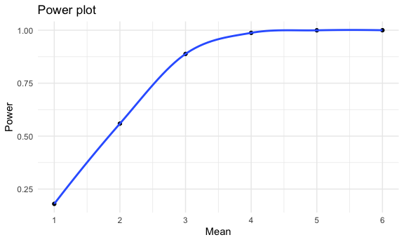
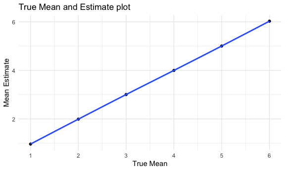
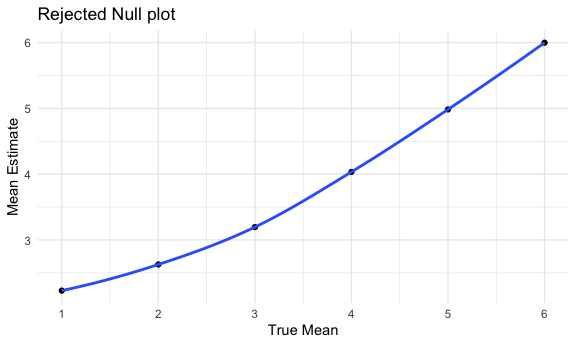

p8105_hw5_mff2137
================
Mohammad Fouda

## Problem 2

### Read in the data

First, we read in the `homicide-data` and create a `city-state` variable

``` r
homicide <-
  read_csv("data/homicide-data.csv") %>% 
  mutate(city_state = str_c(city, ", ", state)) 
```

    ## Rows: 52179 Columns: 12
    ## ── Column specification ────────────────────────────────────────────────────────
    ## Delimiter: ","
    ## chr (9): uid, victim_last, victim_first, victim_race, victim_age, victim_sex...
    ## dbl (3): reported_date, lat, lon
    ## 
    ## ℹ Use `spec()` to retrieve the full column specification for this data.
    ## ℹ Specify the column types or set `show_col_types = FALSE` to quiet this message.

### Description

The `homicide` dataset has data on criminal homicides over a decade in
50 of the largest American cities with each row representing a homicide.
It has 13 variables and 52179 observations. Variables include identifier
of each homicide, date reported, victim information (name, sex, race,
age), the city and state where it happened, specific coordinates of the
incident, and the disposition of each case (e.g. closed by arrest,
closed without arrest, open/no arrest).

### Data wrangling

In this step, we summarize across cities to obtain the total number of
homicides and the an the number of unsolved homicides. The total number
of homicides in Baltimore, MD is 2827.

``` r
balt_total <-
  homicide %>% 
  filter(city_state == "Baltimore, MD") %>% 
  group_by(city_state) %>% 
  summarize(total = n()) 

balt_total
```

    ## # A tibble: 1 × 2
    ##   city_state    total
    ##   <chr>         <int>
    ## 1 Baltimore, MD  2827

To obtain the number of unsolved homicides, we summarize by `city-state`
and `disposition`, then combine the number of homicides of which
disposition is “Closed without arrest” or “Open/No arrest”. The number
of unsolved homicides in Baltiomre, MD is 1825

``` r
balt_open <-
  homicide %>% 
  filter(city_state == "Baltimore, MD", disposition %in% c("Closed without arrest", "Open/No arrest")) %>%
  group_by(city_state) %>% 
  summarize(unresolved = n()) 

balt_open
```

    ## # A tibble: 1 × 2
    ##   city_state    unresolved
    ##   <chr>              <int>
    ## 1 Baltimore, MD       1825

This step produces a data frame with counts of both unresolved and total
homicides in Baltimore

``` r
balt_df <-
  inner_join(balt_open, balt_total)
```

    ## Joining, by = "city_state"

``` r
balt_df
```

    ## # A tibble: 1 × 3
    ##   city_state    unresolved total
    ##   <chr>              <int> <int>
    ## 1 Baltimore, MD       1825  2827

The same approach could be used to tidy the `homicide` dataframe to
prepare it for running the `prop.test` on all 50 cities included in the
dataset.

``` r
homicide_open <-
  homicide %>% 
  filter( disposition %in% c("Closed without arrest", "Open/No arrest")) %>%
  group_by(city_state) %>% 
  summarize(unresolved = n())

homicide_total <-
  homicide %>% 
  group_by(city_state) %>% 
  summarize(total = n())

homicide_df <-
  inner_join(homicide_open, homicide_total)
```

    ## Joining, by = "city_state"

``` r
homicide_df
```

    ## # A tibble: 50 × 3
    ##    city_state      unresolved total
    ##    <chr>                <int> <int>
    ##  1 Albuquerque, NM        146   378
    ##  2 Atlanta, GA            373   973
    ##  3 Baltimore, MD         1825  2827
    ##  4 Baton Rouge, LA        196   424
    ##  5 Birmingham, AL         347   800
    ##  6 Boston, MA             310   614
    ##  7 Buffalo, NY            319   521
    ##  8 Charlotte, NC          206   687
    ##  9 Chicago, IL           4073  5535
    ## 10 Cincinnati, OH         309   694
    ## # … with 40 more rows

### Baltimore `prop.test` function

In this step, we create a function to compute the `prop.test` function
in order to estimate the proportion of homicides that are unresolved in
Baltiomore, MD. Using `purr::map` function. The estimate is 0.646 and
the 95% confidence interval is 0.628, 0.663. These results are saved to
a tidy dataframe `balt_prop`.

``` r
prop_test = function(df) {
  
  prop.test(
    x = df %>% pull(unresolved),
    n = df %>% pull(total),
    alternative = c("t"),
    conf.level = 0.95, correct = TRUE) %>% 
  broom::tidy() %>% 
  select(estimate, starts_with("conf"))
}

balt_prop <- prop_test(balt_df)
balt_prop
```

    ## # A tibble: 1 × 3
    ##   estimate conf.low conf.high
    ##      <dbl>    <dbl>     <dbl>
    ## 1    0.646    0.628     0.663

### Applying the function across cities

Using `purr::map2` function, we run the `prop.test` for each of the
cities in the `homicide` dataset, then extract both the proportion of
unsolved homicides and the confidence interval for each, saving the
results in a list column. Next, we unnest as to create a tidy dataframe
with results.

``` r
homicide_prop_df <-
  homicide_df %>%
  mutate(
    prop_results = map2(.x = unresolved, .y = total, ~ prop.test(x = .x, n = .y)  %>% 
  broom::tidy())) %>% 
  unnest() %>% 
  select(city_state, estimate, starts_with("conf"))

homicide_prop_df
```

    ## # A tibble: 50 × 4
    ##    city_state      estimate conf.low conf.high
    ##    <chr>              <dbl>    <dbl>     <dbl>
    ##  1 Albuquerque, NM    0.386    0.337     0.438
    ##  2 Atlanta, GA        0.383    0.353     0.415
    ##  3 Baltimore, MD      0.646    0.628     0.663
    ##  4 Baton Rouge, LA    0.462    0.414     0.511
    ##  5 Birmingham, AL     0.434    0.399     0.469
    ##  6 Boston, MA         0.505    0.465     0.545
    ##  7 Buffalo, NY        0.612    0.569     0.654
    ##  8 Charlotte, NC      0.300    0.266     0.336
    ##  9 Chicago, IL        0.736    0.724     0.747
    ## 10 Cincinnati, OH     0.445    0.408     0.483
    ## # … with 40 more rows

### The Test Estimaes Plot

This creates a plot that shows the estimates and CIs for each city using
`geom_histogram` and `geom_errorbar` for a way to add error bars based
on the upper and lower limits.

``` r
estimates_cl_plot <-
  homicide_prop_df%>%
  mutate (estimate = factor(estimate)) %>%
  ggplot(aes(x=city_state, y=estimate)) + 
    geom_bar(position=position_dodge(), stat="identity") +
    geom_errorbar(aes(ymin=estimate-conf.low, ymax=estimate+conf.high),
                  width=.2,                    
                  position=position_dodge(.9))
```

## Problem 3

This step conducts a simulation to explore power in a one-sample t-test.
The code generates 5000 datasets by iteration for the model, using a
fixed sample size `n = 3` and sigma `sd = 5`. For each dataset, the
estimate `mu hat` and `p-value` arising from the `t.test` are saved in a
dataset cleaned and tidied using `broom::tidy`.

``` r
sim_t = function(n = 30, mu, sigma = 5) {
  
  sample = rnorm(n, mean = mu, sd = sigma)
  test_results = t.test(sample)
  test_results %>% 
  broom::tidy()
}

sim_results_df = 
  expand_grid(
    sample_size = 30,
    true_mean = c(1, 2, 3, 4, 5, 6),
    iteration = 1:5000) %>% 
  mutate(
    estimate_df = map2(.x = sample_size, .y = true_mean, ~ sim_t(n = .x, mu = .y))
  ) %>% 
  unnest(estimate_df)

sim_results_df
```

    ## # A tibble: 30,000 × 11
    ##    sample_size true_mean itera…¹ estim…² stati…³ p.value param…⁴ conf.…⁵ conf.…⁶
    ##          <dbl>     <dbl>   <int>   <dbl>   <dbl>   <dbl>   <dbl>   <dbl>   <dbl>
    ##  1          30         1       1   2.47    2.39   0.0234      29  0.359    4.57 
    ##  2          30         1       2   0.765   0.924  0.363       29 -0.929    2.46 
    ##  3          30         1       3   0.535   0.670  0.508       29 -1.10     2.17 
    ##  4          30         1       4  -0.736  -0.897  0.377       29 -2.42     0.943
    ##  5          30         1       5   1.28    1.56   0.131       29 -0.403    2.96 
    ##  6          30         1       6  -0.393  -0.478  0.636       29 -2.07     1.29 
    ##  7          30         1       7   1.50    1.92   0.0654      29 -0.102    3.10 
    ##  8          30         1       8   0.736   0.886  0.383       29 -0.962    2.43 
    ##  9          30         1       9   0.665   0.700  0.489       29 -1.28     2.61 
    ## 10          30         1      10   1.70    2.15   0.0404      29  0.0796   3.33 
    ## # … with 29,990 more rows, 2 more variables: method <chr>, alternative <chr>,
    ## #   and abbreviated variable names ¹​iteration, ²​estimate, ³​statistic,
    ## #   ⁴​parameter, ⁵​conf.low, ⁶​conf.high

This code chunk creates a plot showing the proportion of times the null
was rejected (the power of the test) on the y axis and the true value of
μ on the x axis. The plots shows that as the effect (mean) size
increase, the power increases.

``` r
total_df <-
  sim_results_df %>% 
  janitor::clean_names() %>% 
  select(true_mean, p_value) %>% 
  group_by(true_mean) %>% 
  summarize(total = n())

reject_df <-
  sim_results_df %>% 
  janitor::clean_names() %>% 
  select(true_mean, p_value) %>% 
  filter(p_value < 0.05) %>% 
  group_by(true_mean) %>% 
  summarize(reject = n())

prop_df_plot<-
  inner_join(reject_df, total_df) %>% 
  mutate(power = reject/total) %>% 
  ggplot(aes(x = true_mean, y = power )) +
  geom_point() +
  geom_smooth(se =FALSE)
```

    ## Joining, by = "true_mean"

``` r
prop_df_plot
```

    ## `geom_smooth()` using method = 'loess' and formula 'y ~ x'



The following code creates two plots, the first showing the average
estimate of μ̂ on the y axis and the true value of μ on the x axis. The
second shows the average estimate of μ̂ only in samples for which the
null was rejected on the y axis and the true value of μ on the x axis.
The sample average of μ̂ across tests for which the null is rejected
approximately equal to the true value of μ since both plots show a
positive linear relationship with the true value of μ.

``` r
mean_est_plot <-
  sim_results_df %>% 
  janitor::clean_names() %>% 
  select(true_mean, estimate) %>% 
  group_by(true_mean) %>% 
  summarize(
    average_est = mean(estimate)) %>% 
  ggplot(aes(x = true_mean, y = average_est)) +
  geom_point() +
  geom_smooth(se =FALSE)

mean_est_plot
```

    ## `geom_smooth()` using method = 'loess' and formula 'y ~ x'



``` r
mean_rej_plot <-
  sim_results_df %>% 
  janitor::clean_names() %>% 
  select(true_mean, estimate, p_value) %>% 
  filter(p_value < 0.05) %>%
  group_by(true_mean) %>% 
  summarize(
    average_est = mean(estimate)) %>% 
  ggplot(aes(x = true_mean, y = average_est)) +
  geom_point()+
  geom_smooth(se =FALSE)

mean_rej_plot
```

    ## `geom_smooth()` using method = 'loess' and formula 'y ~ x'


